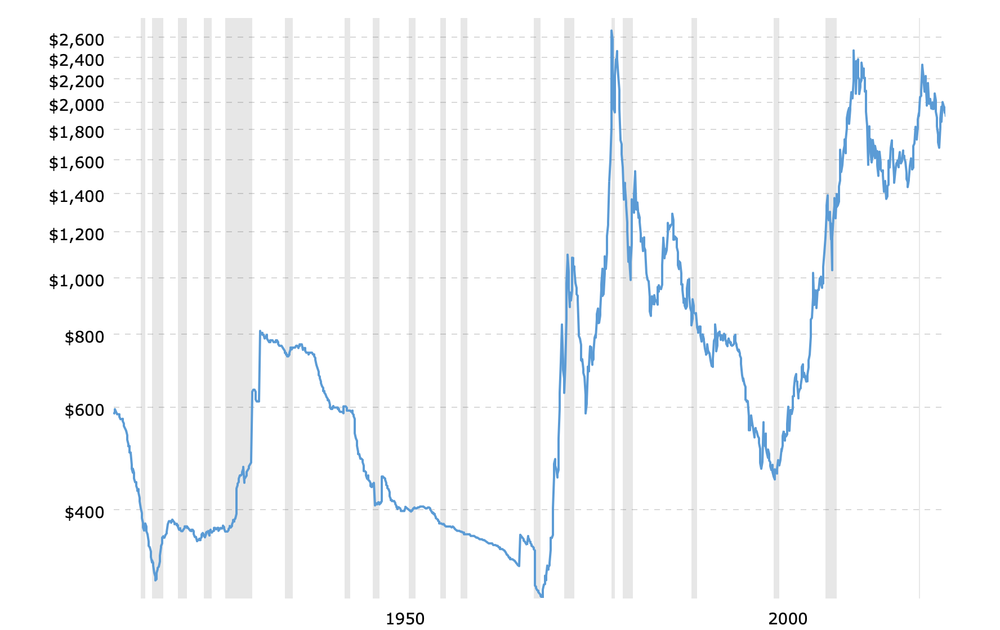

# Monte Carlo Simulation

  
<em>"A Monte Carlo simulation takes the variable that has uncertainty and assigns it a random value. The model is then run and a result is provided. This process is repeated again and again while assigning many different values to the variable in question. Once the simulation is complete, the results are averaged to arrive at an estimate."</em>

---

[Investopedia](https://www.investopedia.com/terms/m/montecarlosimulation.asp)

This could be an interesting use case that ties in with concepts students likely have already gotten familiar with. We could provide them with a sample portfolio of stocks or let them build their own. Possible plug ins to find data could be Yahoo, Quandl, or a CSV purposely scrambled to practice data cleaning.

### Possible Learning Outcomes:

- Working with simple data APIs
- Getting familiar with matplotlib and making graphs in Python
- Great project with real world applicability for banking roles
- Understanding/Building covariance matrix

---

# Predicting Customer Churn for Banking Clients

Found a dataset on Kaggle that has lots of inputs which are commonly used to predict banking churn. This is certainly relevant for the program, but likely will be a new application outside of what is usually done in the regression/time series classes.

The solution on Kaggle suggest using a KNN algorithm. This could serve as a gentle entry into ML algorithms on a dataset which is not too intimidating.

### K-Nearest Neighbors Algorithm

  
<em>"The K-Nearest Neighbor (KNN) algorithm is a popular machine learning technique used for classification and regression tasks. It relies on the idea that similar data points tend to have similar labels or values.

During the training phase, the KNN algorithm stores the entire training dataset as a reference. When making predictions, it calculates the distance between the input data point and all the training examples, using a chosen distance metric such as Euclidean distance.

Next, the algorithm identifies the K nearest neighbors to the input data point based on their distances. In the case of classification, the algorithm assigns the most common class label among the K neighbors as the predicted label for the input data point. For regression, it calculates the average or weighted average of the target values of the K neighbors to predict the value for the input data point."</em>

---

[Analytics Vidhya](https://www.analyticsvidhya.com/blog/2018/03/introduction-k-neighbours-algorithm-clustering/#h-what-is-knn-k-nearest-neighbor-algorithm)

### KNN Algorithm Visualization

  
  

### Possible Learning Outcomes:

- Light introduction to machine learning and algorithms or the analysis could likely also be done with simple regression
- Relevant use case for banking careers
- Great portfolio project and gentle introduction to more complex algorithms

---

#### [Kaggle Dataset Link](https://www.kaggle.com/datasets/mathchi/churn-for-bank-customers)

# Customer Segmentation Dataset

Another Kaggle dataset with information from the marketing campaign of a Portuguese bank with several data points such as job, eduction and balance. What makes this interesting is there are several different ways the segmentation question could be addressed. Additionally, there are several parts of the dataset that likely need to be cleaned, giving students good practice in that area as well.

### What is customer segmentation?

  
<em>"Customer segmentation is the approach of dividing a large and diverse customer base into smaller groups of related customers that are similar in certain ways and relevant to the marketing of a bank’s products and services"</em>

---

[Cognizant](https://www.cognizant.com/us/en/glossary/customer-segmentation-banking#:~:text=Customer%20segmentation%20is%20the%20approach,geography%2C%20income%20and%20spending%20habits.)

### Banking Customer Segmentation Examples:

  
  

### Possible Learning Outcomes:

- Applying analysis techniques to make a subjective classification mathematically sound
- Practice with data visualization techniques and using analysis packages
- Great opportunity to do analysis and certainly many conclusions that could be explored in a more detailed report

#### [Kaggle Dataset Link](https://www.kaggle.com/datasets/adityamhaske/bank-marketing-dataset)

---

# Credit Risk Prediction with Machine Learning

Yet another relatively large Kaggle dataset with various information about borrowers as well as whether a loan is in default or not. Data set is approximately 40k rows, it could be a good opportunity for students to practice training an algorithm, preparing a dataset, identifying relevant variable, and testing for significance among predictors.

---

  
<em>"Whenever a lender extends credit to a borrower, there is a chance that the loan, or some portion of it, will not be paid back. Default risk is the probability of this happening. Default risk can apply both to individuals and to companies that borrow money through loans or by issuing bonds.

Lenders take default risk into account when deciding whether to make a loan and in how they determine your interest rate. Investors consider default risk in deciding whether to buy a company's (or a government's) bonds, and whether the interest rate they're being offered is sufficient compensation for the risk."</em>

---

[Investopedia](https://www.investopedia.com/terms/d/defaultrisk.asp)

### Possible Learning Outcomes:

- Clear relevance to other classes and projects
- Good portfolio project as well as good real world application of machine learning
- Unambiguous results, i.e. the loan is likely to default or not, makes it a good introduction to machine learning

#### [Kaggle Dataset Link](https://www.kaggle.com/datasets/laotse/credit-risk-dataset)

---

# Commodity Time Series Analysis/Price Prediction

Large Kaggle dataset of commodities price data for various precious metal. This is a very interesting topic which has lots of relevance to what is driving markets. Additionally, there is a widely taken commodities course in the 3rd semester. Dataset is continuously being updated so the data is very recent, otherwise dataset can easily be expanded on with publicly available pricing data.

### Lots of recent movement in commodity prices makes for an interesting report topic.

  
There are several different types of analysis and conclusions that can be pulled from this analysis. There are many different directions a report on this topic could be taken. Additionally, Central Banks are likely to make several moves in the coming months, meaning there is likely to be several interesting developments in the next several months.

### Possible Learning Outcomes

- Relevant topic that ties in well with other modules and assignments
- Multidimensionality of analytical strategies with several different directions a paper can go in
- Approachable topic with lots of opportunities to practice data visualization and making graphics
